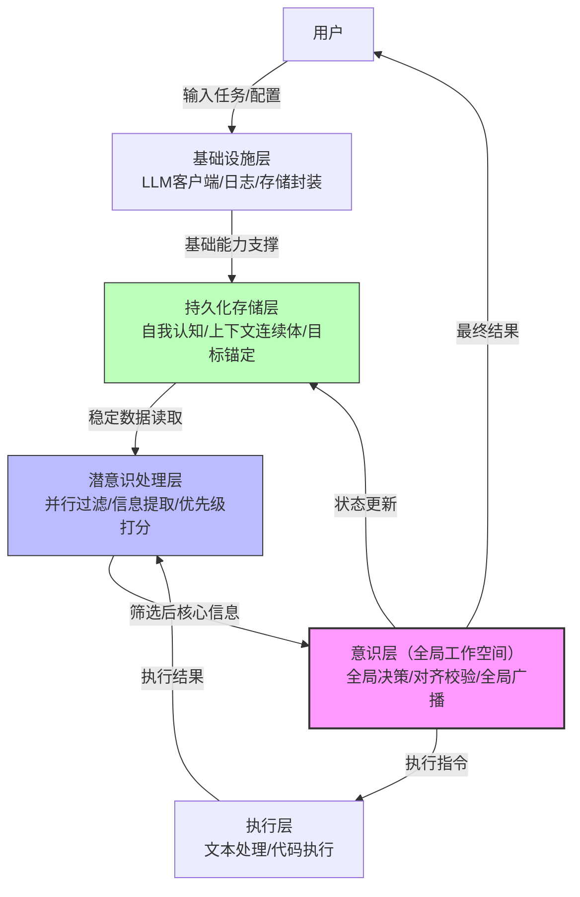

# 基于全局工作空间理论的长任务稳定执行 Agent 内核框架 程序架构设计文档
## 一、整体架构设计
### 1. 文字版架构图


**层级职责与依赖说明**：
- **基础设施层**：最底层，为所有上层提供大模型API调用、统一日志、本地存储等基础能力，无上游依赖；
- **持久化存储层**：依赖基础设施层，负责自我认知、上下文连续体、目标锚定的持久化读写，为潜意识层、意识层提供稳定数据支撑；
- **潜意识处理层**：依赖基础设施层、持久化层，负责全量上下文的并行过滤、核心信息提取、优先级排序，仅将高价值信息传入意识层；
- **意识层（全局工作空间）**：核心决策层，依赖潜意识层、持久化层，负责全局决策生成、目标对齐校验、全系统广播，是唯一有权限生成执行指令的模块；
- **执行层**：依赖意识层，负责接收执行指令、完成具体动作、反馈执行结果，无自主决策能力。

---

### 2. 架构设计核心理念
本架构**严格基于巴尔斯全局工作空间理论（GWT）** 工程化落地，与主流Agent（LangChain ReAct、AutoGPT）的“全量上下文堆叠+单轮无约束决策”架构有本质差异：
1.  **分层映射GWT认知逻辑**：潜意识层对应GWT的“并行无意识专门处理器”，意识层对应“容量有限的全局工作空间”，从根源控制上下文规模，解决上下文爆炸；
2.  **目标锚定注意力资源**：意识层的所有决策必须锚定持久化的根目标，对应GWT中“顶层目标约束注意力分配”的逻辑，彻底解决长任务跑偏；
3.  **持久化背景上下文**：自我认知与上下文连续体独立于临时对话，对应GWT中“稳定背景支撑意识连续性”的逻辑，解决自我认知不稳定与历史遗忘。

**面试亮点**：可重点讲解“如何将认知科学理论转化为工程架构”，这是区别于普通RAG/对话系统项目的核心差异化优势。

---

### 3. 核心数据流转总览
用户输入任务 → 持久化层加载根目标与自我认知 → 潜意识层并行过滤全量上下文 → 意识层基于核心信息生成决策 → 目标对齐校验 → 意识层广播执行指令 → 执行层执行并反馈结果 → 潜意识层接收结果并更新上下文 → 循环直至目标达成。

---

## 二、核心模块详细设计
### 模块M001：基础设施层 - 大模型API客户端
#### 1. 对应GWT理论依据
无直接GWT映射，属于系统基础设施，为GWT架构的落地提供底层大模型调用能力支撑。

#### 2. 模块核心职责
封装主流大模型API，提供统一的调用接口，支持JSON Schema强制约束输出格式，屏蔽不同模型API的差异。

#### 3. 模块输入输出规范
```python
from typing import TypedDict, Optional

class LLMInput(TypedDict):
    system_prompt: str  # 系统提示词
    user_prompt: str     # 用户输入
    json_schema: Optional[dict] = None  # 可选：强制输出的JSON Schema
    temperature: float = 0.7  # 温度参数

class LLMOutput(TypedDict):
    success: bool  # 是否调用成功
    content: str   # 模型输出内容
    error_msg: Optional[str] = None  # 错误信息
```

#### 4. 核心业务逻辑
1.  读取.env中的API密钥与模型名称；
2.  构造符合对应模型API格式的请求；
3.  若指定json_schema，通过Function Call/JSON Mode强制约束输出；
4.  发送请求并接收响应，超时自动重试2次；
5.  解析响应，统一返回LLMOutput格式；
6.  异常分支：重试失败后，返回success=False，记录错误日志。

#### 5. 关键函数/类签名
```python
from abc import ABC, abstractmethod

class BaseLLMClient(ABC):
    """大模型客户端抽象基类，支持后续扩展不同模型"""
    @abstractmethod
    def call(self, input_data: LLMInput) -> LLMOutput:
        """调用大模型，返回统一格式结果"""
        pass

class OpenAIClient(BaseLLMClient):
    """OpenAI API兼容客户端（支持国内开源模型）"""
    def __init__(self, api_key: str, base_url: str, model_name: str):
        self.api_key = api_key
        self.base_url = base_url
        self.model_name = model_name

    def call(self, input_data: LLMInput) -> LLMOutput:
        """实现OpenAI格式的API调用，含重试逻辑"""
        pass
```

#### 6. 可落地伪代码示例
```python
import requests
from utils.logger import get_logger

logger = get_logger(__name__)

class OpenAIClient(BaseLLMClient):
    def call(self, input_data: LLMInput) -> LLMOutput:
        headers = {"Authorization": f"Bearer {self.api_key}"}
        payload = {
            "model": self.model_name,
            "messages": [
                {"role": "system", "content": input_data["system_prompt"]},
                {"role": "user", "content": input_data["user_prompt"]}
            ],
            "temperature": input_data["temperature"]
        }
        if input_data.get("json_schema"):
            payload["response_format"] = {"type": "json_object"}

        for attempt in range(2):
            try:
                response = requests.post(f"{self.base_url}/chat/completions", 
                                       headers=headers, json=payload, timeout=30)
                response.raise_for_status()
                content = response.json()["choices"][0]["message"]["content"]
                logger.info(f"LLM调用成功，第{attempt+1}次尝试")
                return {"success": True, "content": content, "error_msg": None}
            except Exception as e:
                logger.warning(f"LLM调用失败，第{attempt+1}次尝试，错误: {str(e)}")
                if attempt == 1:
                    return {"success": False, "content": "", "error_msg": str(e)}
```

#### 7. 日志与调试接口
- **INFO级别**：记录每次LLM调用的成功/失败、尝试次数；
- **DEBUG级别**：记录完整的请求payload、响应内容（脱敏处理API密钥）。

---

### 模块M002：持久化存储层 - 自我认知管理
#### 1. 对应GWT理论依据
对应GWT中“稳定的自我认知是全局工作空间的核心背景上下文，为意识决策提供持续的自我参照与约束，独立于单次任务临时上下文”的逻辑。

#### 2. 模块核心职责
管理只读的持久化自我认知信息，全程最高优先级，不可被执行过程篡改，为意识层决策提供稳定约束。

#### 3. 模块输入输出规范
```python
from dataclasses import dataclass
from typing import TypedDict, Optional

@dataclass
class SelfCognition:
    role: str          # 角色定位
    core_abilities: str  # 核心能力
    behavior_rules: str  # 行为准则
    prohibitions: str   # 禁止项

class SelfCognitionInput(TypedDict):
    cognition_data: SelfCognition  # 初始化/更新的认知数据

class SelfCognitionOutput(TypedDict):
    success: bool
    cognition: Optional[SelfCognition] = None
    error_msg: Optional[str] = None
```

#### 4. 核心业务逻辑
1.  系统启动时，从本地JSON文件加载自我认知数据；
2.  提供只读接口供意识层读取，禁止任何修改操作；
3.  仅支持系统初始化时的一次性写入，或用户通过明确指令的全量更新；
4.  异常分支：文件损坏时，返回默认认知模板，记录错误日志。

#### 5. 关键函数/类签名
```python
class SelfCognitionManager:
    def __init__(self, storage_path: str = "data/self_cognition.json"):
        self.storage_path = storage_path
        self._cognition: Optional[SelfCognition] = None  # 内部私有变量，只读

    def load(self) -> SelfCognitionOutput:
        """从本地文件加载自我认知，仅启动时调用一次"""
        pass

    def get(self) -> SelfCognition:
        """获取当前自我认知，只读接口，无修改权限"""
        pass

    def _save(self, cognition: SelfCognition) -> SelfCognitionOutput:
        """私有方法：保存认知数据，仅初始化/用户明确更新时调用"""
        pass
```

#### 6. 可落地伪代码示例
```python
import json
import os
from utils.logger import get_logger

logger = get_logger(__name__)

class SelfCognitionManager:
    def __init__(self, storage_path: str = "data/self_cognition.json"):
        self.storage_path = storage_path
        self._cognition = None
        os.makedirs(os.path.dirname(storage_path), exist_ok=True)

    def load(self) -> SelfCognitionOutput:
        try:
            if os.path.exists(self.storage_path):
                with open(self.storage_path, "r", encoding="utf-8") as f:
                    data = json.load(f)
                    self._cognition = SelfCognition(**data)
            else:
                # 默认认知模板
                self._cognition = SelfCognition(
                    role="专注于长任务稳定执行的AI助手",
                    core_abilities="文本处理、基础代码执行",
                    behavior_rules="严格遵循目标，不做无关操作",
                    prohibitions="不编造信息，不执行高危命令"
                )
                self._save(self._cognition)
            logger.info("自我认知加载成功")
            return {"success": True, "cognition": self._cognition, "error_msg": None}
        except Exception as e:
            logger.error(f"自我认知加载失败: {str(e)}")
            return {"success": False, "cognition": None, "error_msg": str(e)}

    def get(self) -> SelfCognition:
        if self._cognition is None:
            raise ValueError("自我认知未初始化，请先调用load()")
        return self._cognition
```

#### 7. 日志与调试接口
- **INFO级别**：记录认知加载/保存的成功状态；
- **DEBUG级别**：记录完整的认知数据内容。

---

### 模块M003：潜意识处理层 - 并行信息过滤
#### 1. 对应GWT理论依据
对应GWT中“大量并行、无意识的专门处理器负责处理海量输入信息，仅与当前目标相关的高价值信息才能进入容量有限的全局工作空间”的逻辑。

#### 2. 模块核心职责
对全量临时上下文进行并行过滤、冗余剔除、核心信息提取、优先级排序，仅将高价值信息传入意识层，从根源控制上下文规模。

#### 3. 模块输入输出规范
```python
from typing import TypedDict, Optional, List

class SubconsciousInput(TypedDict):
    full_context: List[str]  # 全量临时上下文
    root_goal: str           # 根目标（用于关联度判断）
    filter_threshold: int = 7  # 过滤阈值（0-10）

class FilteredInfo(TypedDict):
    content: str  # 核心信息内容
    priority: int  # 优先级打分（0-10）
    relevance: float  # 与根目标的关联度

class SubconsciousOutput(TypedDict):
    success: bool
    filtered_info: Optional[List[FilteredInfo]] = None
    error_msg: Optional[str] = None
```

#### 4. 核心业务逻辑
1.  接收全量上下文与根目标，分发给3个并行处理单元；
2.  单元1：冗余剔除，删除重复、无意义的对话内容；
3.  单元2：核心信息提取，基于LLM提取与根目标强相关的关键数据；
4.  单元3：优先级打分，对提取的信息按关联度0-10分排序；
5.  汇总结果，仅保留优先级≥filter_threshold的信息；
6.  异常分支：过滤后无有效信息时，自动放宽阈值至5，重新处理；仍无则上报异常。

#### 5. 关键函数/类签名
```python
class SubconsciousProcessor:
    def __init__(self, llm_client: BaseLLMClient):
        self.llm_client = llm_client

    def process(self, input_data: SubconsciousInput) -> SubconsciousOutput:
        """执行并行过滤、提取、打分，返回筛选后的核心信息"""
        pass

    def _remove_redundancy(self, context: List[str]) -> List[str]:
        """私有方法：剔除冗余内容"""
        pass

    def _extract_core_info(self, context: List[str], goal: str) -> List[str]:
        """私有方法：基于LLM提取核心信息"""
        pass

    def _rank_priority(self, info_list: List[str], goal: str) -> List[FilteredInfo]:
        """私有方法：优先级打分"""
        pass
```

#### 6. 可落地伪代码示例
```python
from utils.logger import get_logger

logger = get_logger(__name__)

class SubconsciousProcessor:
    def process(self, input_data: SubconsciousInput) -> SubconsciousOutput:
        try:
            logger.info("潜意识层开始处理")
            # 1. 冗余剔除
            clean_context = self._remove_redundancy(input_data["full_context"])
            # 2. 核心信息提取
            core_info = self._extract_core_info(clean_context, input_data["root_goal"])
            # 3. 优先级打分
            ranked_info = self._rank_priority(core_info, input_data["root_goal"])
            # 4. 阈值过滤
            filtered = [info for info in ranked_info if info["priority"] >= input_data["filter_threshold"]]
            
            if not filtered:
                logger.warning("过滤后无有效信息，放宽阈值重试")
                filtered = [info for info in ranked_info if info["priority"] >= 5]
            
            logger.info(f"潜意识层处理完成，筛选出{len(filtered)}条核心信息")
            return {"success": True, "filtered_info": filtered, "error_msg": None}
        except Exception as e:
            logger.error(f"潜意识层处理失败: {str(e)}")
            return {"success": False, "filtered_info": None, "error_msg": str(e)}
```

#### 7. 日志与调试接口
- **INFO级别**：记录处理开始/完成、筛选出的信息数量；
- **DEBUG级别**：记录原始上下文、剔除的冗余内容、每条信息的优先级打分。

---

### 模块M004：意识层 - 目标对齐校验
#### 1. 对应GWT理论依据
对应GWT中“顶层目标持续约束全局工作空间的注意力资源分配，所有意识决策必须与顶层目标对齐，避免注意力分散与任务偏离”的逻辑。

#### 2. 模块核心职责
对意识层生成的决策进行多维度对齐度量化评分、校验判定、跑偏拦截与修正，确保每一轮决策严格锚定根目标。

#### 3. 模块输入输出规范
```python
from typing import TypedDict, Optional

class AlignmentInput(TypedDict):
    decision: str           # 意识层生成的决策
    root_goal: str          # 根目标
    current_milestone: str  # 当前里程碑子目标
    alignment_threshold: int = 90  # 对齐阈值（0-100）

class AlignmentOutput(TypedDict):
    success: bool
    alignment_score: int  # 对齐度得分
    is_aligned: bool      # 是否通过校验
    correction_hint: Optional[str] = None  # 修正提示（轻度跑偏时）
    error_msg: Optional[str] = None
```

#### 4. 核心业务逻辑
1.  接收决策、根目标与当前里程碑；
2.  基于LLM从3个维度加权评分：关联度（60%）、里程碑匹配度（30%）、无效动作（10%）；
3.  判定结果：
    - ≥90分：通过，放行决策；
    - 60-89分：轻度跑偏，返回修正提示，意识层重新生成；
    - <60分：严重跑偏，拦截决策，触发回溯；
4.  异常分支：评分失败时，默认判定为轻度跑偏，返回通用修正提示。

#### 5. 关键函数/类签名
```python
class AttentionController:
    def __init__(self, llm_client: BaseLLMClient):
        self.llm_client = llm_client

    def check_alignment(self, input_data: AlignmentInput) -> AlignmentOutput:
        """执行对齐度校验，返回判定结果与修正提示"""
        pass
```

#### 6. 可落地伪代码示例
```python
import json
from utils.logger import get_logger

logger = get_logger(__name__)

class AttentionController:
    def check_alignment(self, input_data: AlignmentInput) -> AlignmentOutput:
        try:
            system_prompt = """你是目标对齐校验器，需从3个维度评分：
1. 决策与根目标的关联度（0-100，权重60%）
2. 决策与当前里程碑的匹配度（0-100，权重30%）
3. 是否存在无效动作（0-100，权重10%，无无效动作为100）
输出JSON格式：{"score": 综合得分, "reason": "评分理由"}"""
            
            user_prompt = f"根目标：{input_data['root_goal']}\n当前里程碑：{input_data['current_milestone']}\n待校验决策：{input_data['decision']}"
            
            llm_output = self.llm_client.call({
                "system_prompt": system_prompt,
                "user_prompt": user_prompt,
                "json_schema": {"type": "object"},
                "temperature": 0.1
            })
            
            if not llm_output["success"]:
                raise Exception(llm_output["error_msg"])
            
            result = json.loads(llm_output["content"])
            score = result["score"]
            is_aligned = score >= input_data["alignment_threshold"]
            correction_hint = None if is_aligned else f"决策对齐度不足（{score}分），请参考：{result['reason']}"
            
            logger.info(f"目标对齐校验完成，得分：{score}，通过：{is_aligned}")
            return {
                "success": True,
                "alignment_score": score,
                "is_aligned": is_aligned,
                "correction_hint": correction_hint,
                "error_msg": None
            }
        except Exception as e:
            logger.error(f"目标对齐校验失败: {str(e)}")
            return {
                "success": False,
                "alignment_score": 0,
                "is_aligned": False,
                "correction_hint": "请重新生成与目标对齐的决策",
                "error_msg": str(e)
            }
```

#### 7. 日志与调试接口
- **INFO级别**：记录校验完成、得分、是否通过；
- **DEBUG级别**：记录完整的评分理由、修正提示内容。

---

### 模块M005：执行层 - 基础执行器
#### 1. 对应GWT理论依据
对应GWT中“执行处理器接收全局工作空间的广播指令，完成具体动作，无自主决策能力，仅反馈执行结果”的逻辑。

#### 2. 模块核心职责
接收意识层的标准化执行指令，调用文本处理或代码执行器完成动作，反馈执行结果，无自主决策。

#### 3. 模块输入输出规范
```python
from typing import TypedDict, Optional

class ExecutionInput(TypedDict):
    action_type: str  # "text_process" 或 "code_execute"
    action_content: str  # 具体动作内容

class ExecutionOutput(TypedDict):
    success: bool
    result: Optional[str] = None
    error_msg: Optional[str] = None
```

#### 4. 核心业务逻辑
1.  接收执行指令，判断action_type；
2.  文本处理：直接基于LLM完成文本总结、提取等操作；
3.  代码执行：在本地沙箱执行Python代码（仅允许基础操作），捕获输出与异常；
4.  统一返回执行结果；
5.  异常分支：代码执行高危命令时，直接拦截，返回安全警告。

#### 5. 关键函数/类签名
```python
from abc import ABC, abstractmethod

class BaseExecutor(ABC):
    @abstractmethod
    def execute(self, content: str) -> ExecutionOutput:
        pass

class TextProcessor(BaseExecutor):
    def __init__(self, llm_client: BaseLLMClient):
        self.llm_client = llm_client

    def execute(self, content: str) -> ExecutionOutput:
        pass

class CodeExecutor(BaseExecutor):
    def execute(self, content: str) -> ExecutionOutput:
        pass

class ExecutionManager:
    def __init__(self, text_processor: TextProcessor, code_executor: CodeExecutor):
        self.executors = {
            "text_process": text_processor,
            "code_execute": code_executor
        }

    def run(self, input_data: ExecutionInput) -> ExecutionOutput:
        pass
```

#### 6. 可落地伪代码示例
```python
import subprocess
import sys
from utils.logger import get_logger

logger = get_logger(__name__)

class CodeExecutor(BaseExecutor):
    def execute(self, content: str) -> ExecutionOutput:
        # 简单的高危命令拦截
        dangerous_keywords = ["os.system", "subprocess", "shutil", "eval", "exec"]
        for kw in dangerous_keywords:
            if kw in content:
                return {"success": False, "result": None, "error_msg": f"禁止执行高危命令：{kw}"}
        
        try:
            # 本地沙箱执行（简化版，生产环境需更严格隔离）
            result = subprocess.run(
                [sys.executable, "-c", content],
                capture_output=True,
                text=True,
                timeout=10
            )
            output = result.stdout + result.stderr
            logger.info("代码执行成功")
            return {"success": True, "result": output, "error_msg": None}
        except Exception as e:
            logger.error(f"代码执行失败: {str(e)}")
            return {"success": False, "result": None, "error_msg": str(e)}
```

#### 7. 日志与调试接口
- **INFO级别**：记录执行开始/完成、动作类型；
- **DEBUG级别**：记录完整的执行内容、输出结果。

---

## 三、基于LangGraph的核心状态机设计
### 1. 核心状态定义
```python
from typing import TypedDict, Optional, List

class AgentState(TypedDict):
    """Agent核心状态，仅保留MVP必需字段"""
    # 对话与上下文
    messages: List[str]  # 全量临时对话历史
    # 目标相关
    root_goal: str  # 不可篡改的根目标
    current_milestone: str  # 当前里程碑子目标
    milestones_completed: List[str]  # 已完成的里程碑
    # 核心数据
    self_cognition_str: str  # 自我认知的字符串表示（只读）
    context_continuum: List[str]  # 上下文连续体（追加写）
    # 执行状态
    current_decision: Optional[str] = None  # 当前待校验决策
    alignment_score: Optional[int] = None  # 最新对齐度得分
    execution_result: Optional[str] = None  # 最新执行结果
    # 控制状态
    loop_count: int = 0  # 循环次数（防死循环）
    is_finished: bool = False  # 是否完成
```

---

### 2. 状态流转规则
1.  **INIT → SUB_CONSCIOUS**：初始化完成，加载根目标与自我认知，自动流转；
2.  **SUB_CONSCIOUS → CONSCIOUS_DECISION**：潜意识处理完成，生成有效核心信息，自动流转；
3.  **SUB_CONSCIOUS → ERROR**：连续2次过滤无有效信息，流转异常；
4.  **CONSCIOUS_DECISION → ALIGNMENT_CHECK**：决策生成完成，自动流转；
5.  **ALIGNMENT_CHECK → EXECUTE**：对齐度≥90分，通过校验；
6.  **ALIGNMENT_CHECK → CONSCIOUS_DECISION**：60-89分，轻度跑偏，返回重新生成；
7.  **ALIGNMENT_CHECK → SUB_CONSCIOUS**：<60分，严重跑偏，回溯至潜意识层；
8.  **EXECUTE → UPDATE_CONTEXT**：执行完成，生成有效结果；
9.  **UPDATE_CONTEXT → SUB_CONSCIOUS**：上下文更新完成，未达成所有里程碑，开启下一轮；
10. **UPDATE_CONTEXT → FINISHED**：所有里程碑完成，终止任务；
11. **任意状态 → ERROR**：出现不可恢复异常，或loop_count≥100；
12. **ERROR → FINISHED**：用户确认终止，或异常无法恢复。

---

### 3. 状态节点定义
| 状态节点名称 | 对应处理模块 | 核心职责 |
|--------------|--------------|----------|
| `init_state` | 持久化层 | 加载自我认知、根目标，初始化状态 |
| `subconscious_process` | 潜意识处理层 | 并行过滤、提取、排序核心信息 |
| `conscious_decision` | 意识层 | 基于核心信息生成全局决策 |
| `alignment_check` | 注意力管控机制 | 对齐度校验、跑偏拦截 |
| `execute_action` | 执行层 | 执行具体动作、反馈结果 |
| `update_context` | 持久化层 | 追加写入上下文连续体、更新里程碑 |
| `error_handler` | 基础设施层 | 处理异常、上报用户 |

---

### 4. 终止条件定义
1.  **正常终止**：`milestones_completed`包含所有拆解的里程碑，`is_finished`设为True；
2.  **异常终止**：出现不可恢复异常，或`loop_count`≥100；
3.  **强制终止**：用户在对话中输入“终止”“停止”等关键词。

---

### 5. 可落地伪代码示例
```python
from langgraph.graph import StateGraph, END
from utils.logger import get_logger

logger = get_logger(__name__)

def build_agent_graph(
    subconscious: SubconsciousProcessor,
    attention_controller: AttentionController,
    execution_manager: ExecutionManager
) -> StateGraph:
    graph = StateGraph(AgentState)

    # 1. 节点定义
    def init_node(state: AgentState) -> AgentState:
        logger.info("初始化状态")
        state["loop_count"] = 0
        state["is_finished"] = False
        return state

    def subconscious_node(state: AgentState) -> AgentState:
        logger.info(f"潜意识层处理，第{state['loop_count']}轮")
        result = subconscious.process({
            "full_context": state["messages"],
            "root_goal": state["root_goal"]
        })
        if not result["success"]:
            state["is_finished"] = True
            return state
        # 将筛选后的信息存入messages，供意识层使用
        state["messages"].append(f"[潜意识筛选] {result['filtered_info']}")
        return state

    def alignment_node(state: AgentState) -> AgentState:
        logger.info("目标对齐校验")
        result = attention_controller.check_alignment({
            "decision": state["current_decision"],
            "root_goal": state["root_goal"],
            "current_milestone": state["current_milestone"]
        })
        state["alignment_score"] = result["alignment_score"]
        return state

    # 2. 节点注册
    graph.add_node("init", init_node)
    graph.add_node("subconscious", subconscious_node)
    graph.add_node("alignment", alignment_node)
    # ... 其他节点注册

    # 3. 边定义
    graph.set_entry_point("init")
    graph.add_edge("init", "subconscious")
    
    # 条件边：对齐校验结果分支
    def alignment_router(state: AgentState) -> str:
        if state["alignment_score"] >= 90:
            return "execute"
        elif 60 <= state["alignment_score"] < 90:
            return "conscious_decision"
        else:
            return "subconscious"
    
    graph.add_conditional_edges(
        "alignment",
        alignment_router,
        {
            "execute": "execute",
            "conscious_decision": "conscious_decision",
            "subconscious": "subconscious"
        }
    )
    
    # 终止边
    def should_finish(state: AgentState) -> str:
        if state["is_finished"] or state["loop_count"] >= 100:
            return END
        return "subconscious"
    
    graph.add_conditional_edges("update_context", should_finish)

    return graph.compile()
```

---

## 四、技术选型与依赖管理
### 1. 核心技术栈清单
| 技术组件 | 版本要求 | 选型原因 | 核心作用 |
|----------|----------|----------|----------|
| Python | 3.10-3.12 | 学生开发者最熟悉的语言，生态完善 | 核心开发语言 |
| LangGraph | 0.2.45 | 轻量级状态机框架，专为Agent设计，无需复杂配置 | 实现核心状态流转 |
| LangChain | 0.3.14 | 提供基础的LLM封装，无需重复造轮子 | LLM调用的辅助封装 |
| python-dotenv | 1.0.1 | 零配置管理环境变量，敏感信息不硬编码 | 配置管理 |
| logging | Python内置 | 统一日志管理，方便调试与面试展示 | 日志输出 |
| json | Python内置 | 标准化数据格式，跨模块数据交换 | 数据序列化 |

---

### 2. 依赖管理方案（requirements.txt）
```txt
# requirements.txt - 精确版本锁定，一键安装无冲突
langgraph==0.2.45
langchain==0.3.14
langchain-openai==0.2.14
python-dotenv==1.0.1
```

---

### 3. 配置管理方案（.env.example）
```env
# .env.example - 配置文件模板，复制为.env后填写
# 大模型API配置（支持OpenAI兼容的国内开源模型）
OPENAI_API_KEY=your_api_key_here
OPENAI_BASE_URL=https://api.openai.com/v1
OPENAI_MODEL_NAME=gpt-4o-mini  # 推荐用低成本模型验证

# 日志配置
LOG_LEVEL=INFO  # DEBUG/INFO/WARNING/ERROR

# 存储配置
STORAGE_PATH=data/
```

---

## 五、完整目录结构设计
```
gwt_agent_framework/
├── core/                          # 核心架构模块（对应5层架构）
│   ├── __init__.py
│   ├── infrastructure.py         # 基础设施层：LLM客户端、存储封装
│   ├── persistence.py            # 持久化存储层：自我认知、上下文连续体、目标锚定
│   ├── subconscious.py           # 潜意识处理层：并行过滤、信息提取、优先级打分
│   ├── global_workspace.py       # 意识层：全局决策生成
│   ├── attention_control.py      # 全局注意力管控机制：目标对齐校验
│   └── executors.py              # 执行层：文本处理、代码执行
├── state/                         # LangGraph状态机相关
│   ├── __init__.py
│   ├── agent_state.py            # 核心状态定义（TypedDict）
│   └── graph.py                  # 状态机构建与编译
├── utils/                         # 工具类
│   ├── __init__.py
│   ├── logger.py                 # 统一日志管理
│   └── storage.py                # 本地文件存储封装
├── data/                          # 本地持久化数据目录（gitignore）
│   ├── self_cognition.json
│   └── context_continuum.json
├── tests/                         # 单元测试（MVP阶段可选，重点测对齐校验）
│   ├── __init__.py
│   └── test_attention_control.py
├── .env.example                   # 配置文件模板
├── .gitignore
├── requirements.txt               # 依赖清单
├── main.py                        # 项目入口：命令行交互
└── README.md                      # 项目说明（含架构亮点、快速开始）
```

**目录职责说明**：
- `core/`：核心业务逻辑，严格对应5层架构，每个文件对应一个核心模块；
- `state/`：状态机相关，与业务逻辑解耦，方便后续调整状态流转；
- `utils/`：通用工具，无业务逻辑，可复用；
- `data/`：本地数据，gitignore，不提交到仓库。

---

## 六、核心开发规范
### 1. 代码注释规范
所有核心类、函数必须使用Google风格注释：
```python
def check_alignment(self, input_data: AlignmentInput) -> AlignmentOutput:
    """执行目标对齐度校验，判定决策是否与根目标对齐。

    基于LLM从关联度、里程碑匹配度、无效动作三个维度加权评分，
    根据得分判定是否通过校验，轻度跑偏返回修正提示，严重跑偏触发回溯。

    Args:
        input_data: 包含待校验决策、根目标、当前里程碑的输入数据

    Returns:
        AlignmentOutput: 包含对齐度得分、是否通过、修正提示的输出结果

    Raises:
        ValueError: 输入数据缺失必填字段时抛出
    """
    pass
```

---

### 2. 日志规范
统一使用`utils.logger.get_logger(__name__)`获取logger，格式固定：
```python
# 日志格式：[时间] [级别] [模块名] 消息
LOG_FORMAT = "[%(asctime)s] [%(levelname)s] [%(name)s] %(message)s"

# 日志级别使用：
# - INFO：核心流程节点（状态流转、模块处理完成）
# - DEBUG：详细数据（输入输出、中间结果）
# - WARNING：可恢复异常（重试、放宽阈值）
# - ERROR：不可恢复异常（调用失败、数据损坏）
```

---

### 3. 异常处理规范
1.  所有可能异常的环节必须有try-except；
2.  捕获异常后必须记录ERROR级别日志，包含错误信息与堆栈；
3.  不得静默失败，必须通过返回值的`success`字段或明确异常上报用户；
4.  可恢复异常（如LLM调用超时）必须自动重试，最多2次。

---

### 4. Git提交规范
提交信息格式：`<type>: <subject>`，type可选：
- `feat`：新增核心功能
- `fix`：修复Bug
- `docs`：文档更新
- `refactor`：代码重构（无功能变化）
- `test`：测试相关
- `chore`：构建/依赖相关

示例：
```
feat: 完成潜意识层并行过滤模块
fix: 修复目标对齐校验JSON解析失败的问题
docs: 更新README添加架构设计说明
```

---

## 七、MVP开发优先级与里程碑
### 1. 核心模块开发优先级
按依赖关系排序，无依赖的模块优先开发：
1.  **基础设施层**（M001）：所有上层模块的基础，必须最先完成；
2.  **持久化存储层**（M002）：依赖基础设施层，为意识层、潜意识层提供数据；
3.  **潜意识处理层**（M003）：依赖基础设施层、持久化层；
4.  **意识层与注意力管控**（M004）：依赖潜意识层、持久化层，核心决策逻辑；
5.  **执行层**（M005）：依赖意识层；
6.  **LangGraph状态机联调**：依赖所有核心模块，最后完成全流程闭环。

---

### 2. 按天拆分的开发里程碑
| 开发天数 | 核心开发模块 | 交付物 | 验收标准 |
|----------|--------------|--------|----------|
| Day1 | 基础设施层（LLM客户端、日志、存储） | `core/infrastructure.py`、`utils/logger.py` | LLM可正常调用，日志输出正常，本地文件读写正常 |
| Day2 | 持久化存储层（自我认知、上下文连续体） | `core/persistence.py` | 自我认知只读不可修改，上下文连续体仅可追加写，重启数据不丢失 |
| Day3 | 潜意识处理层（并行过滤、信息提取） | `core/subconscious.py` | 上下文过滤率≥80%，核心信息提取准确率≥95% |
| Day4 | 意识层决策 + 注意力管控机制 | `core/global_workspace.py`、`core/attention_control.py` | 对齐度评分准确，≥90分通过，<60分拦截 |
| Day5 | 执行层（文本、代码执行器） | `core/executors.py` | 文本处理正常，代码执行器可运行基础Python代码，拦截高危命令 |
| Day6 | LangGraph状态机 + 全流程联调 | `state/graph.py`、`main.py` | 全流程无断点，状态流转正常，可完成简单长任务 |
| Day7 | 测试、Bug修复、文档完善 | 完整可运行项目、README.md | 所有核心功能验收通过，文档清晰，可直接克隆运行 |

---

## 八、核心技术风险与应对方案
| 风险描述 | 应对方案 |
|----------|----------|
| LangGraph状态流转异常，出现死循环、状态卡死 | 1. 先做最小状态机Demo（仅INIT→SUB→END），验证流转正常后再接入业务；<br>2. 严格设置`loop_count`上限（≥100强制终止）；<br>3. 每个状态节点添加INFO日志，直观看到流转路径 |
| 大模型幻觉导致对齐校验评分不准确，出现误判 | 1. 使用低temperature（0.1）+ Few-Shot示例优化评分Prompt；<br>2. 用JSON Schema强制约束输出格式，避免非结构化内容；<br>3. 严重跑偏（<60分）的判定需结合上一轮上下文二次确认 |
| 潜意识过滤丢失关键信息，导致意识层决策无依据 | 1. 优化信息提取Prompt，明确“必须保留的关键信息类型”；<br>2. 过滤阈值设为可配置（.env中调整），平衡过滤率与召回率；<br>3. 过滤后无有效信息时，自动放宽阈值并重试，仍无则保留原始上下文摘要 |
| 代码执行器安全风险，执行高危命令破坏本地环境 | 1. 简化版沙箱：拦截`os.system`、`subprocess`等高危关键词；<br>2. 代码执行超时限制（10s），避免无限循环；<br>3. MVP阶段仅用于验证，明确告知用户“不要执行不信任的代码” |
| 1周内无法完成全流程联调，延期交付 | 1. 严格遵守MVP边界，非核心功能一律不做；<br>2. 每天按里程碑验收，当天问题当天解决，不堆积；<br>3. 优先保证核心链路（INIT→SUB→CONSCIOUS→ALIGN→EXEC→END），边缘异常处理可简化 |


